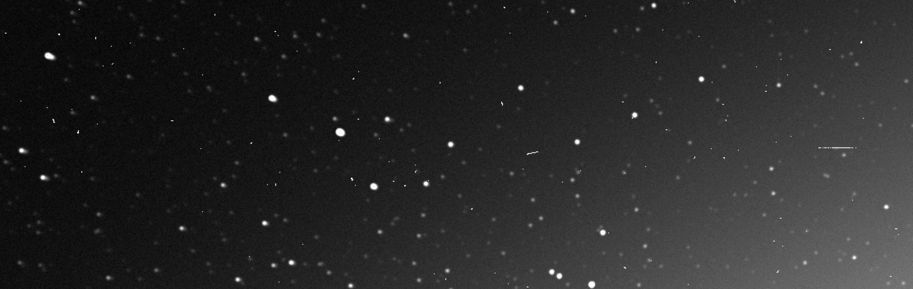

# punchpipe

`punchpipe` is the data processing pipeline for [the PUNCH mission](https://punch.space.swri.edu/).
The primary science code and calibration functionality lives in [punchbowl](https://github.com/punch-mission/punchbowl). 
This package automates the control segment for the Science Operations Center.
It also includes the functionality to create synthetic observations via the `simpunch` subpackage. 

> [!CAUTION]
> This package will likely have breaking changes during commissioning (the first few months after launch). 
> Stability is not promised until v1.

## First-time setup

Coming soon.

## Running

Coming soon.

## Simulating observations

The simulation portion of punchpipe, called `simpunch`, 
accepts a total brightness and polarized brightness image as input.
These have been created using the
[FORWARD code](https://www.frontiersin.org/journals/astronomy-and-space-sciences/articles/10.3389/fspas.2016.00008/full)
from [GAMERA simulation data ](https://arxiv.org/pdf/2405.13069).
These images are fed backward through the pipeline from level 3 to level 0, adding appropriate effects along the way.

## Getting help

Please open an issue or discussion on this repo.

## Contributing

We encourage all contributions.
If you have a problem with the code or would like to see a new feature, please open an issue.
Or you can submit a pull request.
